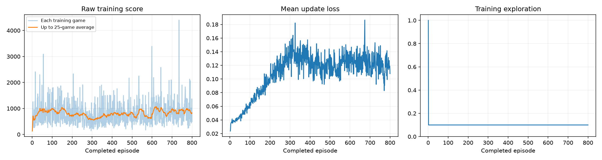
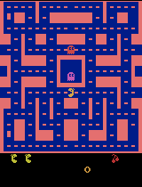
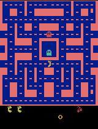

# Ms. Pac-Man DQN — Class 3 submission

A Deep Q-Network trained to play `ALE/MsPacman-v5` using the class notebook. The submitted run
trained for **800 episodes** and more than **doubled** the mean score of the untrained baseline
under the unchanged class evaluation protocol.

| | Untrained baseline | Trained agent |
|---|---|---|
| Mean score over the five evaluation games | 492.0 | **1032.0** |

Full scores, evidence, and honest reporting of two weaker earlier runs are below.

---

## Open and run the notebook

**Colab:** [open `pacman_dqn.ipynb` in Google Colab](https://colab.research.google.com/github/kureemn/pacman-dqn-submission/blob/main/pacman_dqn.ipynb),
select **Runtime → Change runtime type → GPU**, then **Runtime → Run all**. The first cell installs
the packages it needs.

**Local Jupyter or VS Code:**

```sh
git clone https://github.com/kureemn/pacman-dqn-submission.git
cd pacman-dqn-submission
python -m venv .venv
source .venv/bin/activate        # Windows PowerShell: .venv\Scripts\Activate.ps1
python -m pip install -r requirements.txt
python -m jupyter lab pacman_dqn.ipynb
```

Select a Python 3.11–3.13 kernel and choose **Run All**. CUDA, Apple Silicon MPS, and CPU are
detected automatically. Reproducing the submitted run takes about 73 minutes on an Apple M1 Pro.

The executed notebook in this repository, **[`pacman_dqn.ipynb`](pacman_dqn.ipynb)**, retains all
outputs from the final run: scores, dashboard, and gameplay GIFs are visible on GitHub without
rerunning anything.

---

## My three choices

| Setting | Value | Why |
|---|---|---|
| **Exploration** | `0.10` | Evaluation runs at 5% exploration, so training at 20% put the agent in a noticeably noisier world than the one it is graded in. In Ms. Pac-Man a single random step into a ghost ends a life, so a high constant epsilon both suppresses scores and pollutes replay with deaths the policy did not choose. 10% keeps genuine exploration while staying closer to evaluation conditions. Measured directly: run 2 at 0.20 scored 768; run 3 at 0.10 scored 1032. |
| **Episodes** | `800` | Training is fast on this hardware (~11 episodes/minute), so episode budget was the cheapest lever available. Earlier runs showed 100 episodes was far too short to generalize (+12 points) and 400 was still improving at the end. 800 episodes gave 122,849 learning updates — enough for the policy to consolidate rather than just track recent experience. |
| **Learning rate** | `0.0001` | Kept at the notebook's reference value. The failure mode in my first run was *instability* — training score rising while evaluation score stayed flat — not slow learning, and raising the learning rate on an unstable setup generally makes it worse. Holding this fixed across all three runs also kept the comparison between them interpretable. |

### Two other hyperparameters I changed, and why

The assignment permits tuning other settings with an explanation. I changed two, both in response to
evidence from run 1 rather than guesswork:

| Setting | Stock | Mine | Reason |
|---|---|---|---|
| `REPLAY_CAPACITY` | 5,000 | **15,000** | Run 1 averaged ~612 decisions per episode, so a 5,000-transition buffer held barely 8 games. The network was learning almost entirely from its own recent behavior, which is how run 1 produced a rising training score alongside a flat evaluation score. 15,000 retains roughly 25 games. |
| `TARGET_EVERY` | 1,000 | **2,000** | The target network supplies the "correct answer" each update aims at. Syncing every 1,000 decisions moved that target roughly every 1.6 episodes, so the network was chasing a shifting goalpost. The DQN paper uses 10,000 steps at full Atari scale; 2,000 is a middle ground suited to this shorter budget. |

**Evaluation settings were not touched.** The same five seeds (`101, 202, 303, 404, 505`), 5%
evaluation exploration, and the 3,000-decision cap apply identically before and after training, as
the assignment requires.

---

## What I expected, and what actually happened

**Before training I expected** a modest but clear improvement over the untrained baseline, and I
expected the training score curve to be the place where I would see it — a line that rises steadily
as the agent gets better, with the final evaluation confirming what the curve already showed.

**What actually happened** was different in three ways, and each one was more informative than the
result I expected:

1. **The training curve is a poor proxy for the graded score.** In run 1 the training score climbed
   from ~450 to ~750 while the evaluation mean moved just +12. In the submitted run the training
   average *fell* from 882 (episodes 1-100) to ~700 mid-run before recovering to 887, while the
   evaluation score more than doubled. Training runs at 10% exploration and evaluation at 5%, so the
   two measure different things; only the five-seed evaluation counts.

2. **The loss went up, not down.** Mean update loss rose from 0.02 to about 0.14 and plateaued. An
   untrained network predicts near-zero values for every move, which is trivially self-consistent and
   produces tiny errors. As the agent learned that pellets and ghosts genuinely carry value, its
   Q-values grew in magnitude and so did the absolute error between prediction and target. Rising
   loss here reflects the scale of what is being learned, not failure — the assignment's warning that
   lower loss does not mean better play turned out to be inverted in my run.

3. **I misjudged a mid-run dip as degradation.** Around episode 250-350 the 25-game average dropped
   roughly 30% below its earlier peak and I read it as the policy collapsing. It was noise: episodes
   601-800 were the strongest blocks of the entire run (means of 910 and 887, including a single game
   scoring 4,400). With per-episode scores ranging from 130 to 4,400, even 50- and 100-episode
   windows are rough estimates.

---

## Results

### All five evaluation scores

Same five seeds, 5% exploration, 3,000-decision cap, before and after training. The baseline is an
**untrained network**, not a random-action agent.

| Game (seed) | Before (untrained) | After (trained) | Change |
|---|---|---|---|
| 1 (101) | 350 | 360 | +10 |
| 2 (202) | 500 | **1410** | +910 |
| 3 (303) | 320 | **1230** | +910 |
| 4 (404) | 800 | **1270** | +470 |
| 5 (505) | 490 | **890** | +400 |
| **Mean** | **492.0** | **1032.0** | **+540.0** |

Four of the five seeds improved substantially; seed 101 was essentially unchanged. No game hit the
time limit in either condition. Full data: **[`results/comparison.json`](results/comparison.json)**.

Five games is a small sample and these numbers carry real noise — the improvement is credible
because it appears across four independent seeds, not because any single score is precise.

### Training dashboard



Left: raw score per training game (pale) with the 25-game average (orange). Centre: mean update loss,
which rises as Q-values grow. Right: exploration, held constant at 0.10 after the 1,000-decision
random warm-up.

### Gameplay

| Untrained (baseline) | Trained (best of five evaluation games) |
|---|---|
|  |  |

Progress samples recorded during training, every 200 episodes:

| Episode 100 | Episode 200 | Episode 400 | Episode 600 | Episode 800 |
|---|---|---|---|---|
|  |  |  |  |  |

All GIFs play at 4× speed and show at most the first 20 seconds of game time; the reported scores
cover entire games.

Comparing the two clips over that identical 20-second window: the untrained agent stays in a narrow
region near where it spawns, reaches 350 points, and has already lost a life by the end of the
excerpt. The trained agent travels much further through the maze, working down through corridors
instead of circling one area, and reaches 630 points in the same time. It also **eats a power
pellet** — visible as all four ghosts turning blue early in the clip, which never happens in the
untrained excerpt. Whether it seeks power pellets deliberately or simply runs into them while
covering more ground, I cannot tell from one clip.

One caveat on this comparison: the notebook records the untrained excerpt from the *first* evaluation
seed but the trained excerpt from the *best-scoring* of the five games, so these two GIFs are not the
same game. They illustrate the difference; the five-seed table above is the actual evidence.

### What the run actually cost

| | |
|---|---|
| Completed episodes | **800 of 800** (run completed; not interrupted) |
| Total decisions | **492,394** |
| Learning updates | **122,849** |
| Elapsed time | **4,388 seconds (~73 minutes)**, including periodic demonstrations |
| Hardware | Apple M1 Pro, 16 GB RAM, macOS 26.6.2, PyTorch **MPS** backend |
| Software | Python 3.12.14, torch 2.14.0, gymnasium 1.3.0, ale-py 0.11.2 |

This run completed normally and performed a large number of learning updates. Neither this run nor
either earlier run was interrupted, and none finished with zero learning updates.

Evidence files: **[`config.json`](results/config.json)** ·
**[`training.csv`](results/training.csv)** ·
**[`training_summary.json`](results/training_summary.json)** ·
**[`comparison.json`](results/comparison.json)** ·
**[`baseline.json`](results/baseline.json)** ·
**[`demo_scores.json`](results/demo_scores.json)**

---

## Earlier runs, reported honestly

The submitted run was my third. The first two are reported here because the first one in particular
did *not* work, and the reason it failed is what motivated every change that followed.

| Run | Exploration | Episodes | Replay | Target sync | Baseline mean | Trained mean | Change |
|---|---|---|---|---|---|---|---|
| 1 | 0.20 | 100 | 5,000 | 1,000 | 492.0 | 504.0 | **+12.0** |
| 2 | 0.20 | 400 | 15,000 | 2,000 | 492.0 | 768.0 | +276.0 |
| 3 (submitted) | **0.10** | **800** | 15,000 | 2,000 | 492.0 | **1032.0** | **+540.0** |

**Run 1 essentially did not learn anything that generalized.** Its mean improved by 12 points, well
inside noise, and two of its five games scored *worse* than the untrained network. Its training
score meanwhile rose to ~750, which is what first showed me that the training curve can look healthy
while the graded result is flat.

Evidence for the earlier runs: [`run1_comparison.json`](results/earlier_runs/run1_comparison.json) ·
[`run1_training_summary.json`](results/earlier_runs/run1_training_summary.json) ·
[`run2_comparison.json`](results/earlier_runs/run2_comparison.json) ·
[`run2_training_summary.json`](results/earlier_runs/run2_training_summary.json) ·
[`run2_training_dashboard.png`](results/earlier_runs/run2_training_dashboard.png)

---

## How the agent works, in plain language

**What it observes.** The agent never sees the game the way a person does. Each screen is shrunk to
an 84 × 84 grayscale image, and **four consecutive screens are stacked** into one observation. Four
screens rather than one because a single frozen image cannot show which way anything is moving — from
one picture you cannot tell whether a ghost is coming toward you or away. One "decision" covers four
emulator frames.

**What it can do.** Nine joystick actions: do nothing, the four directions, and the four diagonals.
That is the agent's entire vocabulary. It has no concept of a pellet, a ghost, or a maze — only
pixels in, one of nine moves out.

**How it is rewarded.** The game's own points are the reward: pellets, power pellets, fruit, and
eaten ghosts. During learning these rewards are clipped to the range −1 to +1 so that one enormous
payoff cannot dominate every update, but **every score reported in this README is the raw game
score**. Nobody tells the agent that ghosts are dangerous or that pellets are good; it infers all of
it from points arriving after certain moves.

**How it learns.** A convolutional network estimates the future value of each of the nine moves.
The agent mostly picks its highest-valued move and occasionally moves at random. Experiences go into
a replay memory, and batches of 32 are sampled from it to adjust the network toward
`reward + 0.99 × (value of what came next)`, where a second, slower-updating copy of the network
supplies that second term.

---

## One limitation

**Five evaluation games is too small a sample to rank agents confidently.** My own results show why:
the per-episode training scores in this run ranged from 130 to 4,400, so a single game says
very little. The gap between run 2 (768) and run 3 (1032) rests on five games per condition, and
seed 101 barely moved even in the winning run. I believe the improvement is real because it shows up
on four of five independent seeds and across two successive runs, but the *precise* mean is not a
stable quantity, and small differences between two agents on this protocol should not be treated as
meaningful. Anything close to this score is, for practical purposes, a tie.

A second, narrower limitation worth recording: `ReplayMemory.sample()` calls
`rng.sample(list(self.items), size)`, which copies the entire replay deque on every sampling call.
Raising replay capacity to 15,000 therefore cut throughput from about 200 to 114 decisions per
second — the tuning that improved learning also made each run substantially slower.

## One next experiment

**Change only the exploration rate, from 0.10 to 0.05, and keep episodes at 800 and the learning rate
at 0.0001.**

Exploration is the setting with the clearest evidence behind it: holding everything else fixed,
dropping it from 0.20 to 0.10 took the mean from 768 to 1032. That is a single data point on a trend,
and the obvious question is whether the trend continues or reverses. 0.05 would match the evaluation
condition exactly, so the agent would train in the same world it is graded in.

I genuinely do not know which way it goes, which is why it is worth running. Lower exploration could
keep helping for the reason 0.10 helped — fewer random steps into ghosts, cleaner replay data. Or it
could hurt: with only 5% random moves and no epsilon decay, the agent may stop encountering states
its current policy avoids, reinforcing its own blind spots. Seed 101 is the case to watch — it scored
360 against a 350 baseline in the winning run, and it was also the weakest seed in run 1, so there may
be a situation in that game this agent does not learn to handle. Less exploration would plausibly make
that worse, and that failure is more informative than another point of mean score.

---

## Where the checkpoints are

Model checkpoints are **not** in this repository — `.pt` files are git-ignored to keep it small.
Each run saves `untrained.pt`, `trained.pt`, and a checkpoint every 25 episodes (6.7 MB each; about
118 MB for the submitted run) into its own timestamped folder under `pacman_runs/`, together with a
ZIP of the complete run. Those ZIPs are kept locally. The published evidence in
[`results/`](results/) contains everything needed to verify the reported numbers; the checkpoints are
only needed to replay the trained agent, and rerunning the notebook regenerates them.

## Repository contents

| Path | What it is |
|---|---|
| [`pacman_dqn.ipynb`](pacman_dqn.ipynb) | The executed notebook from the submitted run, with all outputs |
| [`results/`](results/) | Evidence from the submitted run: scores, dashboard, GIFs, logs |
| [`results/earlier_runs/`](results/earlier_runs/) | Comparison and summary files for runs 1 and 2 |
| [`requirements.txt`](requirements.txt) | Package versions for local setup |
| [`pacman_player.py`](pacman_player.py) | Optional floating GIF player for local notebook runs |

Starter notebook and DQN implementation by [pepealonso95/pacman-dqn](https://github.com/pepealonso95/pacman-dqn).
